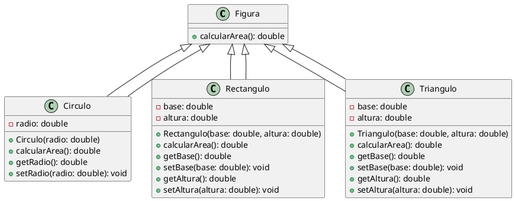

## Diagrama de Clases de Figuras

```plantuml
@startuml
class Figura {
  + calcularArea(): double
}

class Circulo extends Figura {
  - radio: double
  + Circulo(radio: double)
  + calcularArea(): double
  + getRadio(): double
  + setRadio(radio: double): void
}

class Rectangulo extends Figura {
  - base: double
  - altura: double
  + Rectangulo(base: double, altura: double)
  + calcularArea(): double
  + getBase(): double
  + setBase(base: double): void
  + getAltura(): double
  + setAltura(altura: double): void
}

class Triangulo extends Figura {
  - base: double
  - altura: double
  + Triangulo(base: double, altura: double)
  + calcularArea(): double
  + getBase(): double
  + setBase(base: double): void
  + getAltura(): double
  + setAltura(altura: double): void
}

Figura <|-- Circulo
Figura <|-- Rectangulo
Figura <|-- Triangulo
@enduml
```
